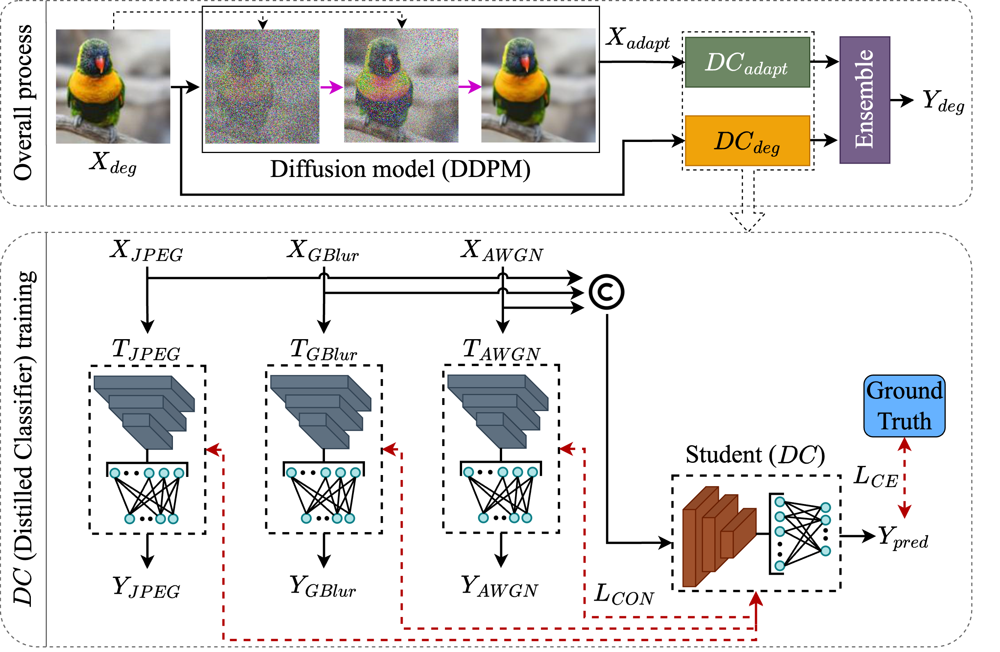

# Diffusion-Based Adaptation for Classification of Unknown Degraded Images

<!-- [[paper](Link here)] -->

This repository contains the source code associated with the paper "Diffusion-Based Adaptation for Classification of Unknown Degraded Images", presented at CVPR 2024 NTIRE workshop.

## Abstract
Classification of unknown degraded images is essential in practical applications since image-degraded models are usually unknown. Diffusion-based models provide enhanced performance for image enhancement and image restoration from degraded images. In this study, we use the diffusion-based model for the adaptation instead of restoration. Restoration from the degraded image aims to restore the degrade-free clean image, while adaptation from the degraded image transforms the degraded image towards a clean image domain. However, the diffusion models struggle to perform image adaptation in case of specific degradations attributable to the unknown degradation models. To address the issue of imperfect adapted clean images from diffusion models for the classification of degraded images, we propose a novel Diffusion-based Adaptation for Unknown Degraded images (DiffAUD) method based on robust classifiers trained on a few known degradations. Our proposed method complements the diffusion models and consistently generalizes well on different types of degradations with varying severities. DiffAUD improves the performance from the baseline diffusion model and clean classifier on the Imagenet-C dataset by 5.5%, 5%, and 5% with ResNet-50, Swin Transformer (Tiny), and ConvNeXt-Tiny backbones, respectively. Moreover, we exhibit that training classifiers using known degradations provides significant performance gains for classifying degraded images. 

## Brief Introduction
Our proposed method is split into three steps as follows: 
1. Apply DDPM on the degraded images $X_{deg}$ to yield adapted images $X_{adapt}$.
2. Feed adapted images $X_{adapt}$ to a distilled classifier trained on adapted images from known degradations, i.e., $DC_{adapt}$ and in parallel, we input degraded images $X_{deg}$ directly to a distilled classifier trained on known degradation images, i.e., $DC_{deg}$.
3. Apply ensemble on the outputs of two distilled classifiers to output $Y_{deg}$. 

<p align="center">
  
  
  Figure 1. Architecture diagram of the proposed method, where the top figure shows the overall inferencing process and the bottom block represents the training process of $DC$ using knowledge distillation from pre-trained teacher networks. Symbol $\copyright$ represents concatenation of inputs $X_{JPEG}$, $X_{GBlur}$, and $X_{AWGN}$. Grey/blue and orange/blue blocks represent pre-trained teacher and student networks.
</p>

<!-- For more details of our proposed method and relevant details please refer to our [paper](link here).  -->

## Installation
To install all the pre-requisite libraries install the docker container from `docker/Dockerfile`. Additionally, you could manually install the missing dependencies described in `docker/Dockerfile` and `docker/requirements.txt`. 

To properly reproduce the results from the paper, please use the provided docker `Dockerfile` and `docker/requirements.txt`. Sample docker build and run commands are as follows:
* `docker build -f docker/Dockerfile -t pytorch_1.12 .`
* `docker run -v /:/data --shm-size 50G -p 8008:8008 -it --gpus '"device=0,1"' pytorch_1.12 /bin/bash`

## Repository Setup

* **Structure of Repository**: 
  * Primarily, our repository is based on two repositories, i.e., [FusionDistill](https://github.com/dineshdaultani/FusionDistill) for Distilled Classifier and [DDA](https://github.com/shiyegao/DDA) for diffusion model/process. 
  * `DDA` directory includes code to apply DDPM adaptation process using `image_adapt` subdirectory as well as to perform inference of recognition models using `model_adapt` subdirectory. 
  * `DistilledClassfier` directory includes code to train distilled classifiers based on known degradations. 
  * Specific steps are discussed in the next section.

* **Evaluation Dataset - Unknown Degradations**: We utilize [CIFAR-10-C](https://zenodo.org/records/2535967) and [Imagenet-C](https://zenodo.org/records/2235448) dataset for single degradation images. Also, sequence of degradation dataset could be prepared by applying `apply_sequence_degs` function available in `DistilledClassifier/utils/data/degtransforms.py` on the given images on both CIFAR-10 and Imagenet datasets. 
* **Diffusion Models and Backbones**: Since, we use pre-trained model trained on clean images, please download relevant models described [here](./DDA/ckpt/README.md). 


## Training / Evaluation
Detailed steps to reproduce the results of our proposed method are as follows:

1. Prepare adapted images of known and unknown degradations: 

  - Known degradations: In `DDA` directory, utilize image_adapt.sh to prepare adapted images of known degraded imagenet dataset. First initialize the parameter values and next run the `image_sample.py` for sampling.  
    ```
    MODEL_PATHS="--model_path ckpt/256x256_diffusion_uncond.pt" # Pre-trained downloaded model

    MODEL_FLAGS="--image_size 256 --attention_resolutions 32,16,8 --class_cond False --learn_sigma True  --num_channels 256 --num_head_channels 64 --num_res_blocks 2 --resblock_updown True --use_fp16 True --use_scale_shift_norm True"
    
    DIFFUSION_FLAGS="--diffusion_steps 1000 --noise_schedule linear"
    SAMPLE_FLAGS="--batch_size 4 --num_samples 10000 --timestep_respacing 100" 
    
    DATA_FLAGS="--base_samples dataset/imagenetc_5k --dataset imagenetc --save_dir dataset/generated/imagenetc_5k/" 
    ```
    ```
    CUDA_VISIBLE_DEVICES=0,1 mpiexec -n 2 python image_adapt/scripts/image_sample.py \
                                          $MODEL_FLAGS $DIFFUSION_FLAGS $SAMPLE_FLAGS $DATA_FLAGS $MODEL_PATHS \
                                          --D 50 --N 4 --scale 6 \
                                          --corruption "<CORRUPTION>" --train True
    ```

  - Unknown degradations: Prepare adapted images of unknown degradations: Similar to the above script change the `DATA_FLAGS` and turn `train` parameter as False while keeping the other parameters same. 
    ```
    DATA_FLAGS="--base_samples dataset/imagenet_50k_deg --dataset imagenet --save_dir dataset/generated/imagenet_50k_deg" 
    ```

    ```
    CUDA_VISIBLE_DEVICES=0,1 mpiexec -n 2 python image_adapt/scripts/image_sample.py \
                                          $MODEL_FLAGS $DIFFUSION_FLAGS $SAMPLE_FLAGS $DATA_FLAGS $MODEL_PATHS \
                                          --D 50 --N 4 --scale 6 \
                                          --corruption "<CORRUPTION>" --train False
    ```

2. Train individual recognition models on known degradation images: Prepare classifier for all three known degradations separately, i.e., `jpeg`, `blur`, and `noise` with parameter `DEG_TYPE`. To train classifier on degraded images use `deg.yaml` config and `adapt.yaml` config for adapted images. 
    ```
      python train.py -c configs/ind/<DATASET>/<BACKBONE>/deg.yaml --dt <DEG_TYPE> 
    ```

    ```
      python train.py -c configs/ind/<DATASET>/<BACKBONE>/adapt.yaml --dt <DEG_TYPE> 
    ```

3. Train distilled classifier models using the three individual classifiers trained on known degradation images. To train classifier on degraded images use `degDistill.yaml` config and `adaptDistill.yaml` config for adapted images. 
    ```
    python train_all_deg.py -c configs/deg_all/<DATASET>/<BACKBONE>/deg_all.yaml 
    python train_all_deg.py -c configs/deg_all/$DATASET/<BACKBONE>/degDistill.yaml
    ```

    ```
    python train_all_deg.py -c configs/deg_all/<DATASET>/<BACKBONE>/adaptDistill.yaml 
    ```  

4. Evaluation - Apply ensemble of degraded and adapted distilled classifiers. Replace `DEG_DISTILL_CL_PATH` and `ADAPT_DISTILL_CL_PATH` with distilled classifier trained on degraded and adapted images respectively. Replace `MODEL_ROOT_DIR` with the path to `DistilledClassifier` directory.  
    ```
    DATA_FLAGS="--data_prefix1 dataset/imagenetc_5k --data_prefix2 dataset/generated/imagenetc_5k"
    ```

    ```
      python model_adapt/test_ensemble.py model_adapt/configs/ensemble/<BACKBONE>_ensemble_b64_<DATASET>.py \
                <DEG_DISTILL_CL_PATH> --second_model_prefix <ADAPT_DISTILL_CL_PATH> --metrics accuracy --ensemble sum --corruption "<CORRUPTION>" --severity "<SEVERITY>" $DATA_FLAGS \
                --out "<MODEL_ROOT_DIR>/saved/jpeg_blur_noise/Diffusion/DDPM+AdaptDistillCL+DegDistillCL_${BACKBONE}_<DATASET>/eval" 
    ```

### Notes for running experiments:
- Replace `<DATASET>` with either "CIFAR10", or "Imagenet" to run the experiments for specific dataset for training or evaluation scripts. 
- Replace `<DEG_TYPE>` with degradations such as `jpeg`, `blur`, and `noise` when training classifier for individual degradation. 
- Replace `<BACKBONE>` with recognition models such as `ResNet50`, `convnextT`, and `swinT`.
- If you train the model from scratch you need to change `pretrained_path` paths in config yaml files. 
- Replace `<CORRUPTION>` and `<SEVERITY>` with specific corruption of single degradation or sequence of degradations and severity levels respectively. 

## Citation
If you find our work or this repository helpful, please consider citing our work:

```bibtex
@InProceedings{Daultani_2024_CVPR,
    author    = {Daultani, Dinesh and Tanaka, Masayuki and Okutomi, Masatoshi and Endo, Kazuki},
    title     = {Diffusion-Based Adaptation for Classification of Unknown Degraded Images},
    booktitle = {IEEE/CVF Conference on Computer Vision and Pattern Recognition Workshops (CVPRW)},
    year      = {2024},
}
```
